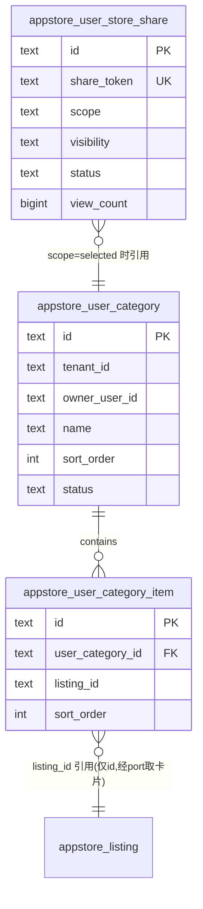

# REQ-2026 用户自定义分类与个人 Appstore（Custom Store）设计

> 状态：草案（待评审） | 领域：appstore | 日期：2026-09-06
> 目标：让每个用户都能创建自己的自定义分类，把 appstore 内的 app 收入其中，并通过对外分享链接形成"人人都有自己的 Appstore"的公开访问体验。

---

## 1. 目标与范围

**做**：
- 用户创建/编辑/排序/删除自定义分类（与平台公开分类完全隔离的独立领域）。
- 用户将 marketplace 内 listing 收入/移出自己的自定义分类。
- 生成对外分享链接（不可枚举 token），访客无需登录即可浏览该用户的个人 Appstore 视图。
- 独立可复用的模块：后端独立 service crate，PC 端独立 workspace 功能包，H5 端独立 module。

**不做**（明确出界，保证低耦合）：
- 不修改现有平台分类 `appstore_category` 及其绑定表。
- 不做跨用户关注/订阅他人 store（后续演进项）。
- 不做自定义分类的多级父子结构（首版扁平列表，sort_order 排序）。

---

## 2. 领域边界与模块划分

核心决策：**个人分类是独立领域 `user-store`（capability：`userStore`），不复用、不污染平台 catalog 分类**。两域之间仅通过 `listing_id` 引用 + 一个 anti-corruption port 拿展示卡片，永不直接 join 平台表。

| 层 | 交付物 | 位置 |
|---|---|---|
| 数据库 | 3 张新表 + 迁移 + registry 登记 | `database/migrations/postgres/`、`database/contract/table-registry.json` |
| 领域服务 | `sdkwork-appstore-user-store-service`（domain / ports / service） | `crates/` |
| 仓储 | repository-sqlx 内新增 `user_store_repository.rs` | `crates/sdkwork-appstore-repository-sqlx/` |
| HTTP 路由 | `sdkwork-routes-appstore-user-store-app-api`（含公开端点） | `crates/` |
| API 契约 | `apis/app-api/store/openapi.yaml` 新增路径 + operationId | `apis/` |
| SDK | `@sdkwork/appstore-app-sdk` 新增 namespace `userCategory` / `userStoreShare` / `publicUserStore` | `sdks/` |
| PC 前端 | 独立包 `sdkwork-appstore-pc-user-store` | `apps/sdkwork-appstore-pc/packages/` |
| H5 前端 | 独立 module `src/modules/user-store/` | `apps/sdkwork-appstore-h5/` |

**关键低耦合设计：`ListingCardProvider` port。**
user-store-service 内部只存 `listing_id`；展示卡片（名称/图标/开发商/评分）通过 port 由 listing 域适配实现提供。个人分类领域不 import listing 表结构，未来 listing 展示字段演进不影响本域。

---

## 3. 数据库设计

遵循现有约定：`id TEXT` 主键（snowflake 字符串）、`tenant_id TEXT NOT NULL`、`created_at/updated_at`、`appstore_` 表前缀、登记 `table-registry.json`。

### 3.1 `appstore_user_category` — 用户自定义分类

```sql
CREATE TABLE appstore_user_category (
    id           TEXT PRIMARY KEY,
    tenant_id    TEXT NOT NULL,
    owner_user_id TEXT NOT NULL,
    name         TEXT NOT NULL,
    description  TEXT,
    icon_media_resource_id TEXT,
    sort_order   INTEGER NOT NULL DEFAULT 0,
    status       TEXT NOT NULL DEFAULT 'active',   -- active | archived
    created_at   TIMESTAMPTZ NOT NULL DEFAULT now(),
    updated_at   TIMESTAMPTZ NOT NULL DEFAULT now(),
    CONSTRAINT uq_user_category_name UNIQUE (tenant_id, owner_user_id, name)
);
CREATE INDEX idx_user_category_owner ON appstore_user_category (tenant_id, owner_user_id, status, sort_order);
```

### 3.2 `appstore_user_category_item` — 分类 ↔ listing 收录

```sql
CREATE TABLE appstore_user_category_item (
    id                TEXT PRIMARY KEY,
    tenant_id         TEXT NOT NULL,
    user_category_id  TEXT NOT NULL REFERENCES appstore_user_category(id) ON DELETE CASCADE,
    listing_id        TEXT NOT NULL,
    note              TEXT,                           -- 用户自己的备注，如"待评估"
    sort_order        INTEGER NOT NULL DEFAULT 0,
    added_at          TIMESTAMPTZ NOT NULL DEFAULT now(),
    created_at        TIMESTAMPTZ NOT NULL DEFAULT now(),
    updated_at        TIMESTAMPTZ NOT NULL DEFAULT now(),
    CONSTRAINT uq_user_category_item UNIQUE (user_category_id, listing_id)
);
CREATE INDEX idx_user_category_item_listing ON appstore_user_category_item (tenant_id, listing_id);
```

反查索引支撑："这个 app 被我收入了哪些分类"（详情页徽标展示）。

### 3.3 `appstore_user_store_share` — 对外分享实体

**分享与分类解耦**：分享的是一个"个人 store 视图"，scope 决定包含全部还是指定分类，未来可扩展聚合视图而无需动分类表。

```sql
CREATE TABLE appstore_user_store_share (
    id            TEXT PRIMARY KEY,
    tenant_id     TEXT NOT NULL,
    owner_user_id TEXT NOT NULL,
    share_token   TEXT NOT NULL,                      -- 22 位 base62 随机串，不可枚举
    title         TEXT NOT NULL,
    description   TEXT,
    scope         TEXT NOT NULL DEFAULT 'all',        -- all | selected
    visibility    TEXT NOT NULL DEFAULT 'public',     -- public | unlisted
    status        TEXT NOT NULL DEFAULT 'active',     -- active | revoked
    expired_at    TIMESTAMPTZ,
    view_count    BIGINT NOT NULL DEFAULT 0,
    created_at    TIMESTAMPTZ NOT NULL DEFAULT now(),
    updated_at    TIMESTAMPTZ NOT NULL DEFAULT now()
);
CREATE UNIQUE INDEX uq_user_store_share_token ON appstore_user_store_share (share_token);
CREATE INDEX idx_user_store_share_owner ON appstore_user_store_share (tenant_id, owner_user_id, status);
```

### 3.4 ER 关系



---

## 4. API 设计（app-api）

前缀沿用 `/app/v3/api/appstore/...`，envelope 为 `SdkWorkApiResponse`（allOf + `item/list`），分页用 Cursor/PageSize，id 一律 string（符合 API_SPEC §13.6 int64 wire contract）。

### 4.1 自定义分类管理（登录态）

| Method | Path | operationId |
|---|---|---|
| POST | `/user-categories` | `appstore.userStore.category.create` |
| GET | `/user-categories`（cursor 分页） | `appstore.userStore.category.list` |
| GET | `/user-categories/{userCategoryId}` | `appstore.userStore.category.get` |
| PATCH | `/user-categories/{userCategoryId}` | `appstore.userStore.category.update` |
| DELETE | `/user-categories/{userCategoryId}` | `appstore.userStore.category.delete` |

### 4.2 分类收录条目

| Method | Path | operationId |
|---|---|---|
| POST | `/user-categories/{userCategoryId}/items` | `appstore.userStore.item.add`（body: `listingId`, `note?`） |
| DELETE | `/user-categories/{userCategoryId}/items/{itemId}` | `appstore.userStore.item.remove` |
| PATCH | `/user-categories/{userCategoryId}/items`（批量 reorder） | `appstore.userStore.item.reorder` |
| GET | `/user-categories/{userCategoryId}/items`（含 listing 卡片，cursor 分页） | `appstore.userStore.item.list` |

### 4.3 分享管理（登录态）

| Method | Path | operationId |
|---|---|---|
| POST | `/user-store-shares` | `appstore.userStore.share.create`（返回完整分享链接） |
| GET | `/user-store-shares` | `appstore.userStore.share.list` |
| PATCH | `/user-store-shares/{shareId}` | `appstore.userStore.share.update`（title/scope/visibility/过期） |
| DELETE | `/user-store-shares/{shareId}` | `appstore.userStore.share.revoke` |
| POST | `/user-store-shares/{shareId}/regenerate-token` | `appstore.userStore.share.regenerateToken` |

### 4.4 公开访问（`security: []`，无需登录）

| Method | Path | operationId |
|---|---|---|
| GET | `/public/user-stores/{shareToken}` | `appstore.userStore.public.view`（owner 昵称 + 标题 + 分类列表） |
| GET | `/public/user-stores/{shareToken}/categories/{userCategoryId}/items` | `appstore.userStore.public.items`（cursor 分页卡片） |

`view_count` 在 public.view 服务端递增；`revoked` / 过期 / `unlisted`+无 token 的请求返回标准 404/410 envelope 错误，不泄露存在性。

> 待评审：公开端点放 app-api（`security: []`，推荐——访客体验属 C 端）还是 open-api。

---

## 5. 后端 crate 设计

```
crates/sdkwork-appstore-user-store-service/
├── src/domain/        # UserCategory / UserCategoryItem / UserStoreShare 聚合与不变量
│   ├── user_category.rs
│   ├── user_category_item.rs
│   └── user_store_share.rs
├── src/ports/
│   ├── user_store_repository.rs    # 仓储 port（由 repository-sqlx 适配）
│   └── listing_card_provider.rs    # 反腐层：向 listing 域取展示卡片
├── src/service/       # 用例：管理分类/收录/分享/公开视图
├── context.rs / error.rs
crates/sdkwork-routes-appstore-user-store-app-api/
├── handlers.rs / routes.rs / mapper/ / error.rs
├── http_route_manifest.rs / runtime.rs
```

- repository-sqlx 新增 `src/repository/user_store_repository.rs`。
- `specs/domain.yaml` 登记 capability `userStore` 与对应 `sdks_namespaces`。
- 单测覆盖：所有权校验（跨租户/跨用户访问一律 404）、token 熵、scope 变更后公开视图一致性、revoke 后 410。

---

## 6. 前端设计

### 6.1 PC：独立功能包 `sdkwork-appstore-pc-user-store`

位置 `apps/sdkwork-appstore-pc/packages/sdkwork-appstore-pc-user-store/`，遵循现有 27 个领域包模式（`src/index.ts` 导出 + 包内 `specs/`），宿主 shell 注册路由、core 注入 app-sdk namespace。

**导出清单（可复用件）**：

```
src/
├── pages/
│   ├── MyCategoriesPage        # 我的分类管理：卡片网格 + 拖拽排序 + 新建/编辑/归档
│   ├── ShareManagePage         # 分享管理：链接列表/复制/二维码/可见性/失效/revoke
│   └── PublicUserStorePage     # 对外体验页（/custom-store/:shareToken）
├── components/
│   ├── CategoryEditorDrawer    # 基本信息 + 搜索收录 app + 已收录排序移除
│   ├── AddToCategoryPopover    # ★核心复用件：app 列表/详情页"加入我的分类"一键收录
│   ├── UserStoreGrid           # 收录 app 卡片网格（复用 commons 的 listing 卡片）
│   └── ShareLinkCard           # 链接 + 二维码 + 状态徽标
└── hooks/
    ├── useUserCategories / useUserCategoryItems / useUserStoreShares
```

`AddToCategoryPopover` 由宿主在 listing 卡片与详情页 actions 处挂载——这是"从 appstore 添加到自定义分类"能力的唯一交互入口，PC/H5 行为对齐。

### 6.2 H5：独立 module `apps/sdkwork-appstore-h5/src/modules/user-store/`

```
src/modules/user-store/
├── pages/
│   ├── MyCategoriesPage / CategoryEditorPage / ShareManagePage
│   └── PublicUserStorePage        # 路由 /store/:shareToken（无登录可访问）
├── components/ （AddToCategorySheet、UserStoreGrid 等移动端形态）
└── hooks/（useUserCategories 等，逻辑与 PC 同构，仅 UI 形态不同）
```

跨端共享的纯逻辑（排序算法、分享链接拼装、token 展示格式化）下沉到 `@sdkwork/appstore-app-sdk` 的 TS 门面，两端不重复实现。

### 6.3 对外分享页（公开体验页）信息架构

```
┌─────────────────────────────────────────┐
│  头部：store 标题 / owner 昵称 / 简介     │
├─────────────────────────────────────────┤
│  分类 Tab（横向滚动） ｜ 全部             │
├─────────────────────────────────────────┤
│  app 卡片网格（名称/图标/开发商/安装）    │
│  cursor 加载更多                         │
└─────────────────────────────────────────┘
```

---

## 7. 安全与合规要点

- 所有写操作校验 `tenant_id + owner_user_id` 归属，跨用户资源一律 404。
- `share_token`：`rand` 生成 128bit 熵 base62，URL 中不含用户 id；regenerate 后旧 token 立即失效。
- 公开端点只读，输出走与登录端相同的 listing 卡片 DTO（不透出 owner 敏感字段）。
- 收录的 app 若在 marketplace 被下架/撤回，公开视图经 `ListingCardProvider` 过滤后自然消失（无需同步清理 item）。

---

## 8. 实施阶段

| 阶段 | 内容 | 验证 |
|---|---|---|
| 0 | 本设计评审 + `specs/domain.yaml` 登记 | 人工评审（schema 变更需确认） |
| 1 | DB 迁移 + `table-registry.json` | migration up/down |
| 2 | service crate + repository + 单测 | `cargo test --workspace` |
| 3 | routes crate + openapi 契约 | `check-api-operation-patterns.mjs`、`check-api-response-envelope.mjs`、`check-pagination.mjs` |
| 4 | app-sdk 生成 | SDK generator + `check-app-sdk-consumer-imports.mjs` |
| 5 | PC 包 + H5 module | `pnpm check` / `pnpm verify` |
| 6 | 端到端联调（收录→分享→隐身窗口访问） | 手工 + 集成测试 |

---

## 9. 需人工确认的决策点

1. **数据库 schema**：新增 3 张表（§3）——按仓库规则需人工确认后方可进入阶段 1。
2. 公开端点归属 app-api（推荐）或 open-api。
3. 删除语义：分类删除 = 硬删除 + item 级联（推荐）还是软删除归档。
4. 分享是否需要过期时间与访问密码（首版仅实现过期，密码列为后续项）。
